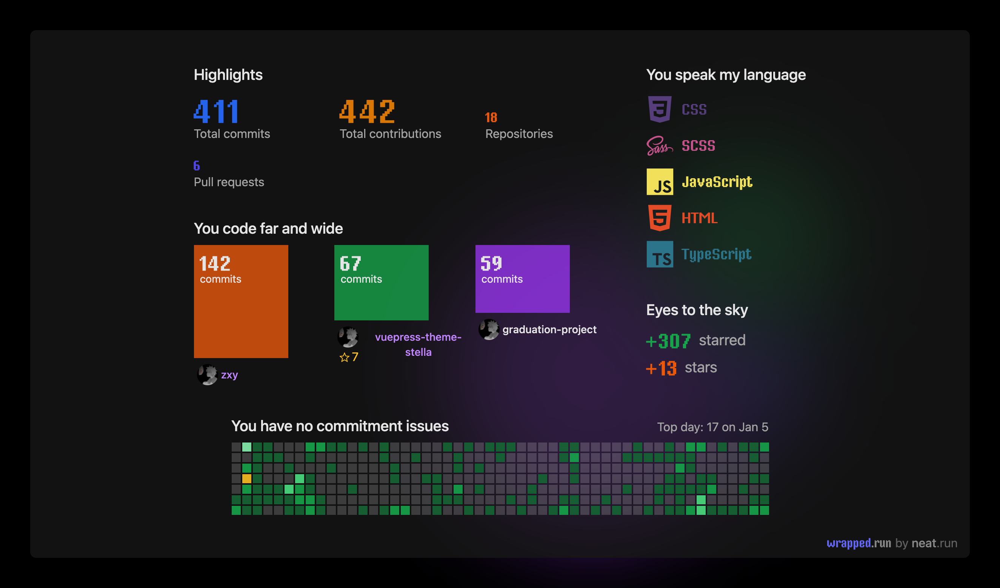

### 👋 Hi there
<!--  -->
- 🌱 I’m currently learning **Linux/Docker/~~Swift~~/Go** 
<!-- - 👯 I’m looking to collaborate on ...
- 🤔 I’m looking for help with ...
- 💬 Ask me about ...
- 📫 How to reach me: ...
- 😄 Pronouns: ...
- ⚡ Fun fact: ...  -->****
### 🔭 Languages & Tools
<code></code>
<code></code>
<code></code>
<code></code>
<code></code>
<code></code>
<code></code>

### 💬 Open Source Work Stats

<!-- ### ✨Individual Project
- [色卡](https://github.com/SHUAXINDIARY/colorGuide)
- [demo-cli](https://github.com/SHUAXINDIARY/demo-cli)：基于gulp封装的开箱即用的ts、less练习开发环境
- [Vuex持久化插件](https://github.com/SHUAXINDIARY/cacheState)：缓存vuex数据 -->

### 😄 2021

<!-- **SHUAXINDIARY/SHUAXINDIARY** is a ✨ _special_ ✨ repository because its `README.md` (this file) appears on your GitHub profile.

Here are some ideas to get you started:

- 🔭 I’m currently working on ...
- 🌱 I’m currently learning ...
- 👯 I’m looking to collaborate on ...
- 🤔 I’m looking for help with ...
- 💬 Ask me about ...
- 📫 How to reach me: ...
- 😄 Pronouns: ...
- ⚡ Fun fact: ... -->

